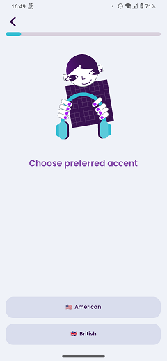

# Choose Your Accent

### Frequency

Once, at the beginning of the Onboarding, user can also navigate back from here.

### Dependencies

[Start Page](StartPage.md)

### Pre-conditions

User should press "Start" on previous page.

### Expected Behaviour

1. The page should have a progress bar on top, filled a bit.

2. It should have Lottie animation (Lexi with Headphones), along with a text "Choose preferred accent" at the bottom of it.

3. It should also have two buttons: American and British.
Pressing any of those will set the accent and take the user to "Language Level" page.

4. Staying idle for a few seconds on this page will play a sample for each accent, American and British.
