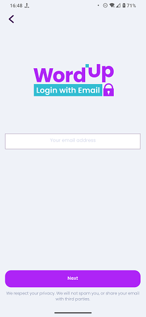

# Enter Email

### Frequency

Once, after Login Page, User can also navigate back from here.

### Dependencies

[Login Page](docs/onboarding/LoginPage.md)

### Pre-conditions

User should press "Sign in with Email" on previous page.

### Expected Behaviour

1. The page should have the WordUp logo(Login with Email) on top.

2. It should have an input field to enter the email. It also has a greyed-out text inside: "Your email address".

3. It should have a "Next" button at the bottom of the page. Pressing this button:
a. If the email input is empty or invalid, it will show an alert saying "Please enter a valid email address."
b. If the email address is valid but not registered, will show a popup saying "This email is not registered with WordUp before." with an "OK" button.
c. If the email address is valid and registered, it will send an email containing a security pin to the entered email, and will take the user to the "Security PIN" page.

4. Under this button, there should be a small text saying "We respect your privacy. We will not spam you, or share your email with third parties.".
