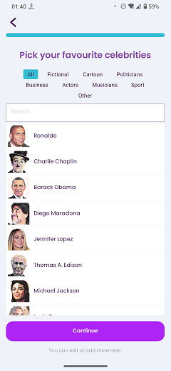

# Favourite Characters

### Frequency

Once, in the middle of the process of Onboarding, user can also navigate back from here.

Also accessible from the "Practice" page.

### Dependencies

[Wordlist Estimate](docs/onboarding/WordlistEstimate.md)/[Onboarding Video](docs/onboarding/OnboardingVideo.md)/[Practice](docs/practice/Practice.md)

### Pre-conditions

User must have pressed "Continue" on the "Onboarding Video" page (Or the "Wordlist Estimate" page if the "Onboarding Video" page fails to show up).

### Expected Behaviour

1. The progress bar on top should be filled completely.

2. It should have a title saying "Pick your favourite celebrities".

3. Under the title, there should be a few tappable titles, showing different categories.
   - The categories are: All, Fictional, Cartoon, Politicians, Business, Actors, Musicians, Sport, and Other. Tapping on any of them will make it highlighted and updates the list with the characters from that category.

4. Under the categories, there should be a search bar to search and find the characters.

5. Under the search bar, there should be a list of Characters. Selecting any of them will make it highlighted and a star icon will be sticked to the selected item. User can select any, all, or none of the characters.

6. There should have be a "Continue" button at the bottom of the page. Pressing it button will navigate the user to the "Signup" Page. This button is only available in the Onboarding process.

7. Under the continue button, there should be a subtitle saying "You can edit or add more later".