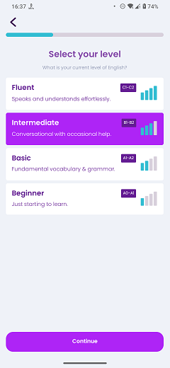

# Language Level

### Frequency

Once, in the middle of the process of Onboarding, user can also navigate back from here.

Also accessible from the preferences.

### Dependencies

[Choose Your Accent](docs/onboarding/ChooseYourAccent.md)

### Pre-conditions

User should press either "American" or "British" on the previous page.

### Expected Behaviour

1. The progress bar on top should fill a bit more.

2. It should have a title "Select your level" with a small subtitle "What is your current level of English?".

3. It should also have 4 big buttons in the middle of the page, each with a title, subtitle, a badge with violet background, and an icon that indicates the level.
   - Fluent: "I speak English like Shakespeare!" with a "C1-C2"badge, an icon containing 4 blue bars.
   - Intermediate: "English ain't no problem, mate!" with a "B1-B2"badge, with an icon containing 3 blue bars and 1 greyed-out bar.
   - Basic: "I speak like Tarzan!" with a "A1-A2"badge, with an icon containing 2 blue bars and 2 greyed-out bars.
   - Beginner: "Me talks English!" with a "A0-A1"badge, with an icon containing 1 blue bar and 3 greyed-out bars.
Choosing any of the above will make it highlighted and selected, set the selected level for the user, and also activate the "Continue" button at the bottom.
TODO: Add the logic behind each level and their relation to common knowledge

4. It should have a "Continue" button at the bottom, greyed-out and untappable by default. It will only be activated if one of the levels above is selected. Pressing it will navigate the user to the "Select Age Group" page.
