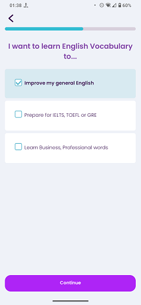

# Learning Goal

### Frequency

Once, in the middle of the process of Onboarding, user can also navigate back from here.

### Dependencies

[Select Language](docs/onboarding/SelectLanguage.md)/[Select UI Language](docs/onboarding/SelectUILanguage.md)

### Pre-conditions

1. User must NOT have selected "8 - 12" group on the "Select Age Group" page.
2. User must have pressed "Continue" on the previous page ("Select Language" or "Select UI Language").

### Expected Behaviour

1. The progress bar on top should fill a bit more.

2. It should have a title saying "I want to learn English Vocabulary to...".

3. Under the title, there should be three checkbox choices:
   - Improve my general English: This is the default choice and it is pre-selected. Going forward with this option only, will skip the "Pick Exams" and "Pick Professions" pages and navigates the user directly to "Pick Topics" page.
   - Prepare for IELTS, TOEFL or GRE: Going forward with this one checked, will navigate the user to "Pick Exams" page and then to the "Pick Topics" page.
   - Learn Business, Professional words: Going forward with this one checked:
     - If the previous choice is also checked, it will navigate the user to "Pick Exams" page, then to the "Pick Professions" page, and then to the "Pick Topics" page.
     - If the previous choice is NOT checked, it will navigate the user to the "Pick Professions" page, and then to the "Pick Topics" page.

4. There should have be a "Continue" button at the bottom of the page. Based on the user's choices on this page, pressing the "Continue" button will navigate the user to the next page.

   #### NOTE
   If the user have chosen "8-12" age group on the "Select Age Group" page, they won't be navigated to "Learning goal" page and will directly go to "Pick Topics" page.