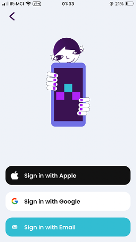

# Login Page

### Frequency

Once, at the beginning of the Onboarding, User can also navigate back from here.

### Dependencies

[Start Page](StartPage.md)

### Pre-conditions

User should press "Login" on previous page.

### Expected Behaviour

1. The page should have a  Lottie animation (Lexi holding a big mobile phone).

2. It can have up to 3 buttons (Depending on the Platform): 
Sign in with Apple (Only on iOS), Sign in with Google (Only on Android and iOS), Sign in with Email

3. Pressing "Sign in with Apple" will start to authenticate the user with Apple ID. If successful, the user will be signed in and redirected to the next page (Depending on their userfile data).

4. Pressing "Sign in with Google" will start to authenticate the user with Google account. If successful, the user will be signed in and redirected to the next page (Depending on their userfile data).

5. Pressing "Sign in with Email" will navigate the user to "Enter Email" page.
