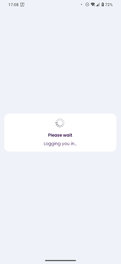

# Login Wait Page

### Frequency

Once, at the beginning of the Onboarding / After successfully loging in.

### Dependencies

[Security PIN](docs/onboarding/SecurityPIN.md)

### Pre-conditions

User should press "Login" on previous page.

### Expected Behaviour

1. The page should have a white container at the center of the page containing:
   - A spinner animation.
   - A bold text "Please wait".
   - A thinner subtitle "Logging you in...". 
   The Elements are horizontally aligned to the middle.

2. Coming from Login: The user will stay on this page for a few seconds before being navigated to the challenge page.
3. Coming from SignUp: The user will stay on this page for a few seconds before being navigated to the subscription comparison page.