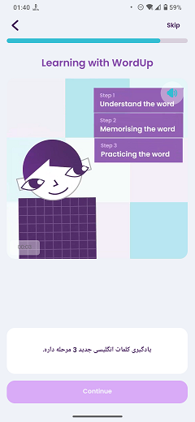

# Onboarding Video

### Frequency

Once, in the middle of the process of Onboarding, user can also navigate back from here.

### Dependencies

[Wordlist Estimate](docs/onboarding/WordlistEstimate.md)

### Pre-conditions

1. The onboarding video must have been downloaded during the process of onboarding.

2. User must have pressed "Continue" on the "Wordlist Estimate" page.

### Expected Behaviour

1. The progress bar on top should fill a bit more.

2. There should be a "Skip" button on the top right corner, which is greyed-out first, but will be enabled after 5 seconds.

3. Under the progress bar, there should be a title saying "Learning with WordUp".

4. Under the title, there will be a video player in squared size, playing the onboarding video.
   - The video player has a mute/unmute button on its top right corner.
   - If the user's chosen language is one of the supported languages for UI Translation, the video will be dubbed with that language as well.
   - The video player has the ability to be paused and resumed. User need to tap on the video.
   - On the bottom left corner of the video player, the duration of the video is shown.

5. Under the video player, there should be a white box, which contains the subtitles of the video. The subtitles will be according to the user's chosen language.

6. There should have be a "Continue" button at the bottom of the page. It is disabled by default and will be enabled after the video is finished. Pressing it will navigate the user to the "Favourite People" page.

