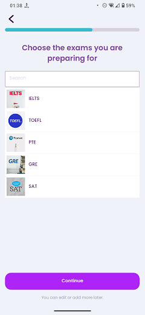

# Pick Exams

### Frequency

Once, in the middle of the process of Onboarding, user can also navigate back from here.

Also accessible from the "My Interests" page.

### Dependencies

[Learning Goal](docs/onboarding/LearningGoal.md)/[My Interests](docs/discover/MyInterests.md)

### Pre-conditions

User must have checked "Prepare for IELTS, TOEFL or GRE" on the "Learning Goal" page. 

### Expected Behaviour

1. The progress bar on top should fill a bit more.

2. It should have a title saying "Choose the exams you are preparing for".

3. Under the title, there should be a search bar to search and find the exams.

4. Under the search bar, there should be a list of English exams. Selecting any of them will make it highlighted and a star icon will be sticked to the selected item. User can select any, all, or none of the exams.

5. There should have be a "Continue" button at the bottom of the page. Based on the user's choices on the "Learning Goal" page, pressing the "Continue" button will navigate the user to the next page.
   #### NOTE
   If the user does not select any of the exams, pressing the "Continue" button will shows the following popup:
   
   

6. Under the continue button, there should be a subtitle saying "You can edit or add more later".
