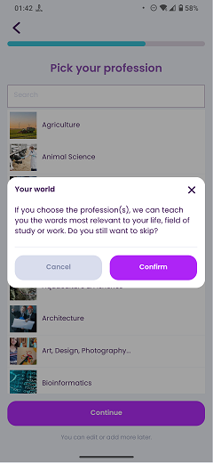

# Pick Professions

### Frequency

Once, in the middle of the process of Onboarding, user can also navigate back from here.

Also accessible from the "My Interests" page.

### Dependencies

[Learning Goal](docs/onboarding/LearningGoal.md)/[Pick Exams](docs/onboarding/PickExams.md)/[My Interests](docs/discover/MyInterests.md)

### Pre-conditions

User must have checked "Learn Business, Professional words" on the "Learning Goal" page. 

### Expected Behaviour

1. The progress bar on top should fill a bit more.

2. It should have a title saying "Pick your profession".

3. Under the title, there should be a search bar to search and find the professions.

4. Under the search bar, there should be a list of professions. Selecting any of them will make it highlighted and a star icon will be sticked to the selected item. User can select up to 3, or none of the professions. If the user tries to select more than 3 professions, an alert will show up, saying "You can only choose up to 3 professions."

5. There should have be a "Continue" button at the bottom of the page. Pressing it button will navigate the user to the "Pick Topics" page.
   #### NOTE
   If the user does not select any of the professions, pressing the "Continue" button will shows the following popup:
   
   

6. Under the continue button, there should be a subtitle saying "You can edit or add more later".