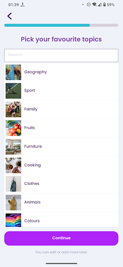

# Pick Topics

### Frequency

Once, in the middle of the process of Onboarding, user can also navigate back from here.

Also accessible from the "My Interests" page.

### Dependencies

[Learning Goal](docs/onboarding/LearningGoal.md)/[Pick Exams](docs/onboarding/PickExams.md)/[Pick Professions](docs/onboarding/PickProfessions.md)/[My Interests](docs/discover/MyInterests.md)

### Pre-conditions

User must have checked at least one of the choices on the "Learning Goal" page. 

### Expected Behaviour

1. The progress bar on top should fill a bit more.

2. It should have a title saying "Pick your favourite topics".

3. Under the title, there should be a search bar to search and find the topics.

4. Under the search bar, there should be a list of topics. Selecting any of them will make it highlighted and a star icon will be sticked to the selected item. User can select any, all, or none of the topics.

5. There should have be a "Continue" button at the bottom of the page. Pressing it button will navigate the user to the "Wordlist Estimate" page. This button is only available in the Onboarding process.

6. Under the continue button, there should be a subtitle saying "You can edit or add more later".

