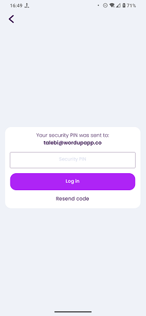

# Security PIN

### Frequency

Once, after Enter Email or SignUp with Email page. User can also navigate back from here.

### Dependencies

[Enter Email](docs/onboarding/EnterEmail.md) / [SignUp with Email](docs/onboarding/SignupWithEmail.md)

### Pre-conditions

Coming from [Enter Email](docs/onboarding/EnterEmail.md):
User should have entered a valid and registered email address, and pressed "Next" button on the previous page.

Coming from [SignUp with Email](docs/onboarding/SignupWithEmail.md):
User should have filled the signup form correctly.

### Expected Behaviour

It should have a box containing:
1. A title saying "Your security PIN was sent to:"

2. The user's email address.

3. An input field to enter the security PIN, along with a greyed-out text "Security PIN".

4. A "Log in" button. Pressing this button:
   - If the PIN input field is empty, it will show an alert saying "Please enter the PIN sent to your email.".
   - If the PIN is invalid, it will show an alert saying "Incorrect PIN. Please enter the pin you received in the registration email.".
   - If the PIN is valid, it will navigate the user to the next page that will show a spinning animation with a text saying "Please wait, logging you in". After that, it will sign the user in and depending on the userfile's data, it will navigate the user to the next page.

5. A "Resend code" hyperlink button. Pressing it will send another PIN email to the user's email address and will invoke an alert saying "A new security pin has been sent to your email".

