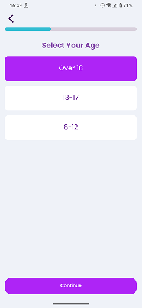

# Select Age Group

### Frequency

Once, in the middle of the process of Onboarding, user can also navigate back from here.

### Dependencies

[Language Level](LanguageLevel.md)

### Pre-conditions

User should have chosen one of the language levels and pressed "Continue" on the previous page

### Expected Behaviour

1. The progress bar on top should fill a bit more.

2. It should have a title "Select your age".

3. It should also have 3 big buttons in the middle of the page, each with a title that indicates the user age group.
a. Over 18, b. 13 - 17, c. 8 - 12
Choosing any of the above will make it highlighted and selected, sets the selected age group for the user, and activates the "Continue" button at the bottom.
Depending on the selection, it will activate or deactivate some pages/fields in the next steps.
By choosing "b" or "c", the SignUp with Email page will have a field for entering the age.
Also, by choosing "c" the page "Learning Goal" won't show up in the onboarding process and the user will go directly to the Pick Favourite topics page.

4. It should have a "Continue" button at the bottom, greyed-out and untappable by default. It will only be activated if one of the age groups above is selected. Pressing it will navigate the user to the "Select Language" page.
