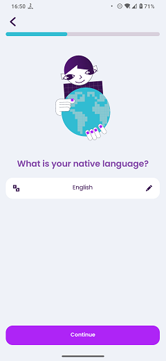

# Select Language

### Frequency

Once, in the middle of the process of Onboarding, user can also navigate back from here.

Also accessible from the preferences.

### Dependencies

[Select Age Group](docs/onboarding/SelectAgeGroup.md)

### Pre-conditions

User should have chosen one of the age groups and pressed "Continue" on the previous page.

### Expected Behaviour

1. The progress bar on top should fill a bit more.

2. It should have a lottie animation, showing Lexi holding the globe.

3. Under the animation, there should be a title saying "What is your native language?".

4. Under the title, there should be a box, showing the language name, with a pencil icon on the right and a translate icon on the left. The default language will be selected according to the user's ip. By tapping on the box, user will see a popup which contains a scrollable list of language. They can also use the search box in the popup to find their desired language.

5. There should have be a "Continue" button at the bottom of the page. Pressing it will set the chosen lanugage for the user and:
   - If the choosen language supports UI translations, it will navigate the user to the "Select UI Language" page.
   - If the choosen language does not support UI translations, it will navigate the user to the "Learning Goal" page.
   
   #### NOTE
   If the user have chosen "8-12" age group on previous page, they won't be navigated to "Learning goal" page and will directly go to "Pick Topics" page.

