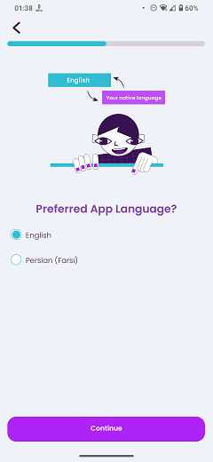

# Select UI Language

### Frequency

Once, in the middle of the process of Onboarding, user can also navigate back from here.

### Dependencies

[Select Language](docs/onboarding/SelectLanguage.md)

### Pre-conditions

User must have chosen one of the UI Translation supported languages and pressed "Continue" on the previous page.

### Expected Behaviour

1. The progress bar on top should fill a bit more.

2. It should have a lottie animation, showing Lexi with two bubbles above her head, with "English" in a cyan bubble and "Your native language" in a purple bubble.

3. Under the animation, there should be a title saying "Preferred App Language?".

4. Under the title, there should be two radio button choices:
   - English: Selecting this option will turn off the UI translation and keeps the English as the preferred UI language.
   - Navive language: This will be the user's chosen language. It is preselected, and it will instantly change the UI language to this language.

5. There should have be a "Continue" button at the bottom of the page. Pressing it will navigate the user to the "Learning Goal" page.

   #### NOTE
   If the user have chosen "8-12" age group on the "Select Age Group" page, they won't be navigated to "Learning goal" page and will directly go to "Pick Topics" page.