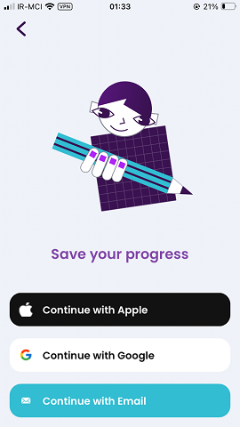

# Signup Page

### Frequency

Once, at the end of the Onboarding, User can also navigate back from here.

### Dependencies

[Favourite Characters](docs/onboarding/FavouriteCharacters.md)

### Pre-conditions

User must have pressed "Continue" on the "Favourite Characters" page.

### Expected Behaviour

1. The page should have a Lottie animation, showing Lexi holding a big pencil.

2. It can have up to 3 buttons (Depending on the Platform): 
Continue with Apple (Only on iOS), Continue with Google (Only on Android and iOS), Continue with Email

1. Pressing "Continue with Apple" will start to authenticate the user with Apple ID. If successful, the user will be redirected to the next page:
   - If the user is not registered yet, it will register the user and will navigate them to the "Subscription Comparison" page.
   - If the user is already registered, it will log the user in and will navigate them to the next page (Depending on their userfile).

2. Pressing "Continue with Google" will start to authenticate the user with Google account. If successful, the user will be redirected to the next page:
   - If the user is not registered yet, it will register the user and will navigate them to the "Subscription Comparison" page.
   - If the user is already registered, it will log the user in and will navigate them to the next page (Depending on their userfile).

3. Pressing "Continue with Email" will navigate the user to "Signup With Email" page.
