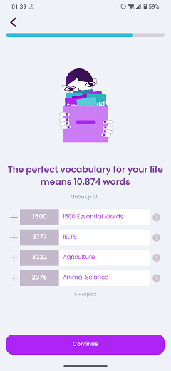

# Wordlist Estimate

### Frequency

Once, in the middle of the process of Onboarding, user can also navigate back from here.

### Dependencies

[Pick Topics](docs/onboarding/PickTopics.md)

### Pre-conditions

User must have pressed "Continue" on the "Pick Topics" page.

### Expected Behaviour

1. The progress bar on top should fill a bit more.

2. It should have a lottie animation, showing Lexi holding a box, catching word cards falling from above.

3. Under the animation, there should be a title:
   - If the user have not selected any exams or professions on previous pages, the title will be "Let's start with 1500 Essential English Words".
   - If the user have selected at least an exam or profession on previous pages, the title will be "The prefect vocabulary for your life means N words" which N is the calculated number of words that user needs to learn.

4. Under the title, there should be a subtitle saying "Made up of...".

5. Under the subtitle, there's a list of rows. Each row contains a plus sign on the left, a grey box containing a number, a white box containing the row title, and a grey circular exclamation mark icon on the right. Based on the user's choices on the "Pick Exams" and "Pick Professions" pages, the number of the rows may differ.
   - The first row is "1500 Essential Words" the number on the left of this row is always 1500.
   - Other rows are the user's chosen Exams and Professions, and their number shows the count of words that does not exist on the previous rows. 
   - If the user has selected any of the topics on the "Pick Topics" page, Under the rows list, there will be a subtitle saying "N+Topics" which N is the count of the chosen topics.
   - If the user taps on any of the exclamation mark icons on the right, a popup will show up that contains some details about that row and its calculated words. 

6. There should have be a "Continue" button at the bottom of the page. Pressing it will navigate the user to the "Onboarding Video" page.

   #### NOTE
   If the onboarding video somehow is unable to be downloaded, the user will be navigated to the "Favourite Characters" page.
